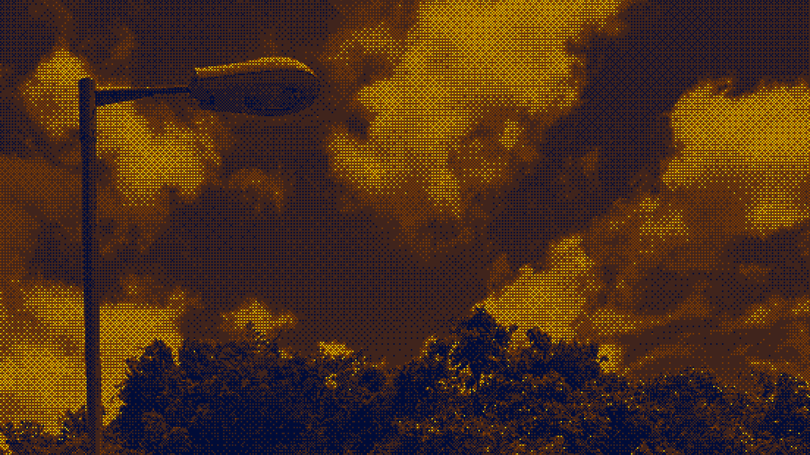

<div align="center">

<a href="https://transition-kit.space">
  
</a>

<br />
<br />

<p>
  <b>An open source library of page transitions and theme toggles for the modern web.</b><br />
  Pure CSS animations for the View Transitions API that run over your live, fully interactive interface.
</p>

<p>
  <a href="https://transition-kit.space"><b>transition-kit.space</b></a> ·
  <a href="https://transition-kit.space/templates">Templates</a> ·
  <a href="https://transition-kit.space/components">Components</a> ·
  <a href="https://transition-kit.space/templates/theme-toggles">Theme toggles</a> ·
  <a href="https://transition-kit.space/templates/page-transitions">Page transitions</a>
</p>

<p>
  <a href="https://github.com/AbdullahMukadam/Transition-kit/stargazers"><picture><source media="(prefers-color-scheme: dark)" srcset="https://shieldcn.dev/github/stars/AbdullahMukadam/Transition-kit.svg?variant=secondary&size=sm&mode=dark" /></picture></a>
  <a href="https://transition-kit.space/templates"><picture><source media="(prefers-color-scheme: dark)" srcset="https://shieldcn.dev/badge/transitions-32.svg?variant=secondary&size=sm&logo=shadcnui&mode=dark" /></picture></a>
  <a href="https://github.com/AbdullahMukadam/Transition-kit"><picture><source media="(prefers-color-scheme: dark)" srcset="https://shieldcn.dev/badge/made_with-View_Transitions_API.svg?variant=secondary&size=sm&mode=dark" /></picture></a>
</p>

<p>
  <picture><source media="(prefers-color-scheme: dark)" srcset="https://shieldcn.dev/badge/React.svg?variant=secondary&size=sm&logo=react&logoColor=61DAFB&mode=dark" /></picture>
  <picture><source media="(prefers-color-scheme: dark)" srcset="https://shieldcn.dev/badge/Next.js.svg?variant=secondary&size=sm&logo=nextdotjs&mode=dark" /></picture>
  <picture><source media="(prefers-color-scheme: dark)" srcset="https://shieldcn.dev/badge/Vue.svg?variant=secondary&size=sm&logo=vuedotjs&logoColor=4FC08D&mode=dark" /></picture>
  <picture><source media="(prefers-color-scheme: dark)" srcset="https://shieldcn.dev/badge/Svelte.svg?variant=secondary&size=sm&logo=svelte&logoColor=FF3E00&mode=dark" /></picture>
  <picture><source media="(prefers-color-scheme: dark)" srcset="https://shieldcn.dev/badge/TypeScript.svg?variant=secondary&size=sm&logo=typescript&logoColor=3178C6&mode=dark" /></picture>
</p>

</div>

## What makes it different

Transition Kit is CSS-first. Every template injects a small animation into the [`::view-transition-old(root)` and `::view-transition-new(root)`](https://developer.mozilla.org/en-US/docs/Web/API/View_Transitions_API) pseudo-elements, then flips the theme or swaps the page through `document.startViewTransition()`. No heavy animation libraries, no wrapper components around your content — the page stays live and interactive while the effect plays.

Where the View Transitions API is not supported, components fall back to an instant, dependency-free swap, so every visitor gets a working page.

<table>
<tr>
<td align="center"></td>
<td><b>32 transitions</b> and counting: Circle Reveal, Cube, Glitch, Page Curl, and more</td>
</tr>
<tr>
<td align="center"></td>
<td><b>Framework agnostic</b>: every template ships for React, Next.js, Vue, Svelte, and vanilla</td>
</tr>
<tr>
<td align="center"></td>
<td><b>Copy, do not install</b>: components land in your repo via a shadcn-compatible registry</td>
</tr>
<tr>
<td align="center"></td>
<td><b>Zero config</b>: self-contained CSS with no dependencies and sensible defaults</td>
</tr>
<tr>
<td align="center"></td>
<td><b>Customize</b>: tune duration, easing, and direction on any template</td>
</tr>
</table>

## Quick start

Add the registry to your `components.json`, then install a component with the shadcn CLI:

```json
{
  "registries": {
    "@transitions": "https://transition-kit.space/r/registry.json"
  }
}
```

```bash
npx shadcn@latest add @transitions/theme-toggle-button
```

Swap `theme-toggle-button` for `animated-theme-toggler`, `theme-toggle-switch`, or `theme-switcher`. Source lands in `components/ui/`, yours to edit.

```tsx
import { ThemeToggleButton } from "@/components/ui/theme-toggle-button";

export default function Page() {
  return <ThemeToggleButton transition="circle-reveal" />;
}
```

Each component is self-contained — the transition CSS is bundled inside it. See the [installation guide](https://transition-kit.space/docs) for manual setup.

## Templates

Browse all templates in the [gallery](https://transition-kit.space/templates), preview them live, and copy the code for your framework.

<details open>
<summary><b>Mask reveals</b>: theme toggles driven by expanding masks</summary>

| Component                                                                     | What it does                                    | Component                                                                       | What it does                              |
| ----------------------------------------------------------------------------- | ----------------------------------------------- | ------------------------------------------------------------------------------- | ----------------------------------------- |
| [**Circle Reveal**](https://transition-kit.space/transition/circle-reveal)    | Expanding circular mask from the center         | [**Circle Blur**](https://transition-kit.space/transition/circle-blur)          | Soft, diffused circular reveal            |
| [**Polygon Reveal**](https://transition-kit.space/transition/polygon-reveal)  | Clip-path polygon wipe                          | [**GIF Frog**](https://transition-kit.space/transition/gif-frog)                | A dancing frog reveals the new theme      |
| [**GIF Penguin**](https://transition-kit.space/transition/gif-penguin)        | Mask reveal with a penguin                      | [**GIF Cat**](https://transition-kit.space/transition/gif-cat)                  | Mask reveal with a cat                    |
| [**Star Reveal**](https://transition-kit.space/transition/star-reveal)        | Expanding star-shaped mask                      | [**Heart Reveal**](https://transition-kit.space/transition/heart-reveal)        | Expanding heart-shaped mask               |
| [**Checkerboard**](https://transition-kit.space/transition/checkerboard-reveal) | Checkerboard tiles expand                       | [**Ripple Reveal**](https://transition-kit.space/transition/ripple-reveal)      | Concentric rings from the click point     |
| [**Spiral Reveal**](https://transition-kit.space/transition/spiral-reveal)    | Spiral-shaped mask                              | [**Iris Wipe**](https://transition-kit.space/transition/iris-wipe-page)         | Film-style iris that closes and opens     |

</details>

<details open>
<summary><b>Simple</b>: page transitions built on transform and opacity</summary>

| Component                                                   | What it does                          | Component                                                     | What it does                          |
| ----------------------------------------------------------- | ------------------------------------- | ------------------------------------------------------------- | ------------------------------------- |
| [**Fade**](https://transition-kit.space/transition/fade)    | Cross-fade between pages              | [**Slide**](https://transition-kit.space/transition/slide)    | Pages slide past each other           |
| [**Scale**](https://transition-kit.space/transition/scale)  | New page scales in                    | [**Rotate**](https://transition-kit.space/transition/rotate)  | New page rotates in from the center   |
| [**Zoom**](https://transition-kit.space/transition/zoom)    | Zoom transition between pages         |                                                               |                                       |

</details>

<details open>
<summary><b>3D</b>: perspective-driven page turns</summary>

| Component                                                       | What it does                              | Component                                                         | What it does                             |
| --------------------------------------------------------------- | ----------------------------------------- | ----------------------------------------------------------------- | ---------------------------------------- |
| [**Flip**](https://transition-kit.space/transition/flip)        | 3D flip around an axis                    | [**Cube**](https://transition-kit.space/transition/cube)          | Pages rotate around a cube axis          |
| [**Skew Slide**](https://transition-kit.space/transition/skew-slide) | Skewed, energetic slide                   | [**Page Curl**](https://transition-kit.space/transition/page-curl) | Old page curls up like a book page       |
| [**Accordion**](https://transition-kit.space/transition/accordion) | Folds shut in vertical pleats             | [**Doorway**](https://transition-kit.space/transition/doorway)    | Page swings away like a door             |
| [**Book Flip**](https://transition-kit.space/transition/book-flip) | Flips like a page on a spine              | [**Fold**](https://transition-kit.space/transition/fold)          | Folds inward along its center            |

</details>

<details open>
<summary><b>Composite</b>: layered clip-path and transform effects</summary>

| Component                                                                 | What it does                             | Component                                                                  | What it does                            |
| ------------------------------------------------------------------------- | ---------------------------------------- | -------------------------------------------------------------------------- | --------------------------------------- |
| [**Blur**](https://transition-kit.space/transition/blur)                  | Blur dissolve between pages              | [**Diagonal Wipe**](https://transition-kit.space/transition/diagonal-wipe) | Diagonal band sweeps across the screen  |
| [**Venetian Blinds**](https://transition-kit.space/transition/venetian-blinds-theme) | Slats clip open one by one               | [**Wave Reveal**](https://transition-kit.space/transition/wave-reveal-theme) | Wavy edge sweeps across the screen      |
| [**Curtain**](https://transition-kit.space/transition/curtain)            | Old page splits apart like curtains      | [**Roll**](https://transition-kit.space/transition/roll)                   | Page rolls away like a scroll           |
| [**Glitch**](https://transition-kit.space/transition/glitch)              | RGB-split slices before the new page     |                                                                            |                                         |

</details>

## Browser support

| Browser                        | Full effect | Fallback                                    |
| ------------------------------ | :---------: | ------------------------------------------- |
| Chrome 111+ / Edge 111+ / Opera 111+ |     ✅      | —                                           |
| Firefox / Safari               |      ⚠️     | Instant swap, still fully functional        |

The View Transitions API is available in Chrome 111+, Edge 111+, and Opera 111+. All templates include a graceful fallback that swaps the theme or page instantly, so the site works everywhere.

## Development

This repo holds the library source, the docs site (TanStack Start, Tailwind v4, on Cloudflare Workers), and the registry build.

```bash
pnpm install
pnpm dev             # starts the dev server on port 3001
pnpm test            # runs the Vitest suite
pnpm build           # generates the sitemap, then production build
pnpm build-registry  # regenerates public/r/* for the shadcn CLI
pnpm deploy          # build and deploy to Cloudflare
```

| Path                                   | What lives here                                                   |
| -------------------------------------- | ----------------------------------------------------------------- |
| `src/data/transitions.ts`              | Single source of truth: CSS, JS, and snippets for all 32 templates |
| `src/components/transitions/`          | Live previews, transition cards, and the playground               |
| `scripts/templates/` + `src/registry/` | shadcn-compatible components (React, Vue, Svelte, vanilla)        |
| `scripts/build-registry.ts`            | Generates `public/r/*.json` for the shadcn CLI                    |
| `content/docs/` + `content/templates/` | Documentation site content                                        |

## Contributing

Issues and pull requests welcome. Open an issue or submit a PR on the [GitHub repo](https://github.com/AbdullahMukadam/Transition-kit).

<div align="center">
<br />
<sub>Built by <a href="https://github.com/AbdullahMukadam">Abdullah Mukadam</a> · <a href="https://transition-kit.space">transition-kit.space</a></sub>
<br /><br />
<a href="https://transition-kit.space"><b>transition-kit.space</b></a>

</div>
